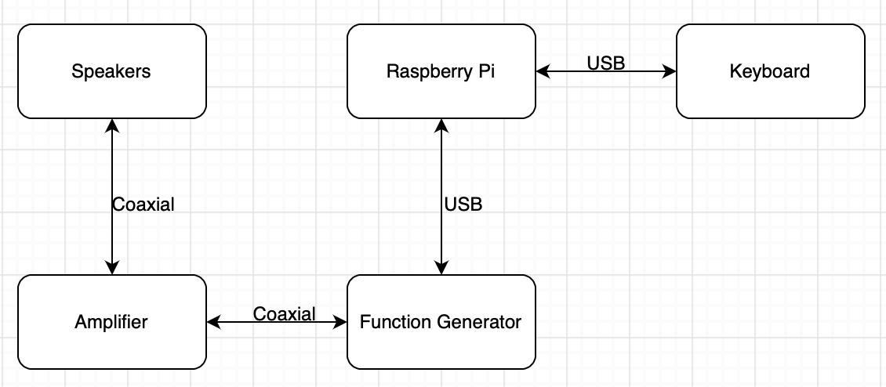

# Development notes

## Our project

In this project an old signal generator was used to make a synthesizer. The signal generator was programmed to output specific signals and waveforms in reponse to input from the MIDI-USB interface. The signals generated by the signal generator are then amplified and played through the tabletop speakers. The laptop was used to host the software that controls the signal generator and processes the MIDI input.

## Parts and components used

* Agilent 33220A Function Generator
* MIDI-USB interface
* Tabletop speakers
* Laptop

## Hardware configuration

This was the plan for the hardware, but changes were made to "Raspberry Pi" and "Keyboard": 
* Instead of a Raspberry Pi, we used a laptop. 
* Instead of connecting the keyboard directly to the laptop, we used a MIDI-USB -interface for the connection.

## Software

The software is a single python script that uses rtmidi to connect to the MIDI-USB -interface and the keysight_kt33000 package to connect to the function generator. Audiolazy is used to convert from MIDI to frequency for the function generator.

## Caveats

## Improvement suggestions for possible future revisions

One possibility could be to run the code on a Raspberry Pi or similar device, which would allow for a more portable and self-contained setup. This could also allow for the addition of additional features or functionality, such as the ability to control the synthesizer remotely or over a network. It may also be possible to incorporate additional hardware or software components to expand the capabilities of the synthesizer.